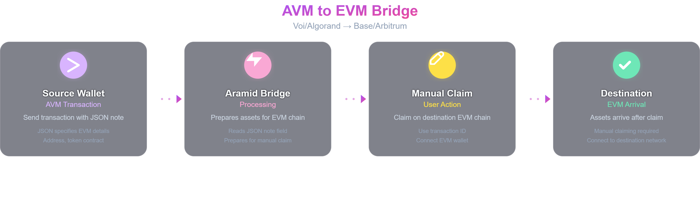
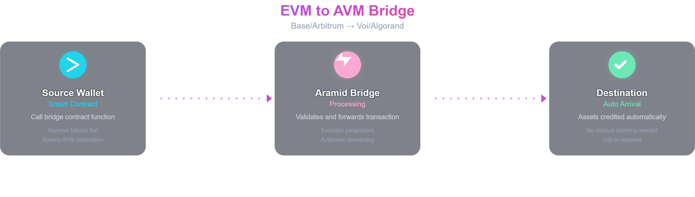

# Arbitrage & Claim

This guide provides practical, example-driven instructions for all four core arbitrage transaction paths supported by Aramid Bridge. Each section includes a real or representative transaction example and clear steps for asset claiming.

---

## Supported Arbitrage Networks

| Network   | Consensus | Chain ID | Symbol | Bridge Address |
|-----------|-----------|----------|--------|----------------|
| Voi       | AVM       | 416101   | VOI    | ARAMIDFJYV2TOFB5MRNZJIXBSAVZCVAUDAPFGKR5PNX4MTILGAZABBTXQQ |
| Algorand  | AVM       | 416001   | ALGO   | ARAMIDFJYV2TOFB5MRNZJIXBSAVZCVAUDAPFGKR5PNX4MTILGAZABBTXQQ |
| Arbitrum  | EVM       | 42161    | AETH   | 0xC7FAA8f8C6D9Dc05ABf3C5aa741a38F9A6d1C263 |
| Base      | EVM       | 8453     | BASE   | 0xC7FAA8f8C6D9Dc05ABf3C5aa741a38F9A6d1C263 |


---

## 1. AVM to AVM Transactions (Voi ↔ Algorand)


**How it works:**
- Initiate from an AVM wallet (e.g., Voi).
- Use a note field with JSON specifying the Algorand address, asset ID, and amounts.
- After confirmation, assets are credited automatically on the destination AVM chain (ensure Algorand opt-in).

**Example Note Field:**

```
{
"destinationNetwork": 416001,
"destinationAddress": "6OTYAIMCZ6DLBXMOOYD7P3AQGWP5IKDVJOHMJWKGUUQXYCZTTZOMKDH4WA",
"destinationToken": "2320775407",
"feeAmount": 185000000,
"destinationAmount": 184815000000,
"note": "aramid",
"sourceAmount": 184815000000
}
```

**Claiming:**  
- **Automatic** for AVM destinations.  
- For Algorand, ensure the destination account is opted-in to the asset before bridging (you have 1000 blocks to opt-in).

---

## 2. AVM to EVM Transactions (Voi/Algorand → Base/Arbitrum)



**How it works:**
- Initiate from an AVM wallet.
- Use a note field with JSON specifying the EVM address, token contract, and amounts.
- After bridge confirmation, claim assets on the EVM chain using the source transaction hash.

**Example Note Field:**

```
{
"destinationNetwork": 8453,
"destinationAddress": "0x42E0793E4F029557D4C16a05Ae0D989A173eC6aA",
"destinationToken": "0x833589fCD6eDb6E08f4c7C32D4f71b54bdA02913",
"feeAmount": 50000,
"destinationAmount": 49950000,
"note": "aramid",
"sourceAmount": 49950000
}
```

**Claiming:**  
- **Manual claiming is required for EVM destinations.**
- Go to: `https://app.aramid.finance/claim/<TRANSACTION_ID>`
- Connect your wallet on the destination EVM network and complete the claim.

---

## 3. EVM to EVM Transactions (Base ↔ Arbitrum) **(!WIP!)**


**How it works:**
- Use the Aramid Bridge app, connect your EVM wallet, and select source/destination EVM networks and asset.
- Approve the bridge contract to spend your tokens, then execute the bridge transaction.
- Destination details are encoded in the contract call (not a JSON note).

**Transaction Structure**

EVM to EVM transactions use smart contract function calls with the function selector and encoded parameters.

**Example Transaction:**  
- [Arbitrum to Base Example](https://arbiscan.io/tx/0xf059143b60b2f0d4c65a7a12540fb2dfb8a0706c0f2b55828c9edd24acfd3051)
- **Direct Claim URL:**  
  `https://app.aramid.finance/claim/0xf059143b60b2f0d4c65a7a12540fb2dfb8a0706c0f2b55828c9edd24acfd3051`

**Decoded Parameters:**
- **sourceToken**: `0x0000000000000000000000000000000000000000` (Native ETH)
- **sourceAmount**: `1,100,000,000,000,000` gwei (0.0011 ETH)
- **feeAmount**: `1,100,000,000,000` gwei (0.000001 ETH)
- **destinationData**: Contains encoded destination token and address
- **note**: `aramid`
- **destinationNetwork**: `8453` (Base)

**Function Call Structure:**

```
function bridgeToEVM(
address sourceToken,
uint256 sourceAmount,
uint256 feeAmount,
bytes destinationData,
string note,
uint256 destinationNetwork
)
```

**Key Differences for EVM to EVM:**
- **No JSON Note Field**: Uses direct smart contract function calls
- **Structured Parameters**: All data passed as function parameters
- **destinationData**: Contains encoded destination token address and recipient address
- **Same Claiming Process**: Uses source transaction ID for claiming

**Claiming:**  
- **Manual claiming is required for EVM destinations.**
- Go to: `https://app.aramid.finance/claim/<TRANSACTION_ID>`
- Connect your wallet on the destination EVM network and complete the claim.

---

## 4. EVM to AVM Transactions (Base/Arbitrum → Voi/Algorand) **(!WIP!)**



**How it works:**
- Use the Aramid Bridge app, connect your EVM wallet, and select EVM source and AVM destination.
- Specify the AVM address and asset ID as the recipient.
- Approve and execute the bridge transaction; destination details are encoded in the contract call.
- After bridge confirmation, assets are credited automatically on the AVM chain.

**Transaction Structure**

EVM to AVM transactions use smart contract function calls with the function selector and encoded parameters.

**Example Transaction:**  
- [Base to Voi (WBTC) Example](https://basescan.org/tx/0x0930608480167608bf14ac3344562106240508f5103da758ef684229ef230d13)
- **WBTC sent from Base to Voi**

**Decoded Parameters:**
- **sourceToken**: `0x0555e30da8f98308edb960aa94c0db47230d2b9c` (WBTC on Base)
- **sourceAmount**: `0000000011` (0.00011 WBTC)
- **destinationToken**: `0x0555e30da8f98308edb960aa94c0db47230d2b9c`
- **feeAmount**: `0000000000010989` (0.00000011 WBTC)
- **destinationNetwork**: `416101` (Voi)
- **destinationAssetId**: `40152643` (aWBTC on Voi)
- **destinationAddress**: `VOIUK3B5KQXVMVMYMLZOELHNABRKV27BP3CZRIK2ZCF7HEFP4F6APX76NM`
- **note**: `aramid`

**Function Call Structure:**

```
function bridgeToAVM(
address sourceToken,
uint256 sourceAmount,
address destinationToken,
uint256 feeAmount,
bytes destinationData,
string note,
uint256 destinationNetwork
)
```

**Key Differences for EVM to AVM:**
- **No JSON Note Field**: Uses direct smart contract function calls
- **Structured Parameters**: All data passed as function parameters
- **destinationData**: Contains encoded destination asset ID and AVM address
- **Automatic Claiming**: Assets arrive automatically on AVM chains

**Claiming:**
- **Automatic** for AVM destinations.
- Ensure the destination account is opted-in to the asset(ASA) before bridging (you have < 1000 blocks to opt-in).
---

## Asset Claiming Process

### EVM Destination Paths (AVM→EVM, EVM→EVM)
- **Manual claiming is required for EVM destinations.**
- Go to: `https://app.aramid.finance/claim/<TRANSACTION_ID>`
- Connect your wallet on the destination EVM network and follow the prompts to receive your bridged asset.

### AVM Destination Paths (AVM→AVM, EVM→AVM)
- **Claiming is automatic for AVM destinations** once the bridge processes the transaction.
- Ensure the destination account is opted-in to the asset before bridging (you have < 1000 blocks).
---

## Technical Transaction Summary

| Transaction Type | Transaction Method | Claiming Method |
|-----------------|-------------------|-------------------|
| AVM to AVM | JSON note field | Automatic |
| AVM to EVM | JSON note field | Manual |
| EVM to EVM | Smart contract call | Manual |
| EVM to AVM | Smart contract call | Automatic |

---

