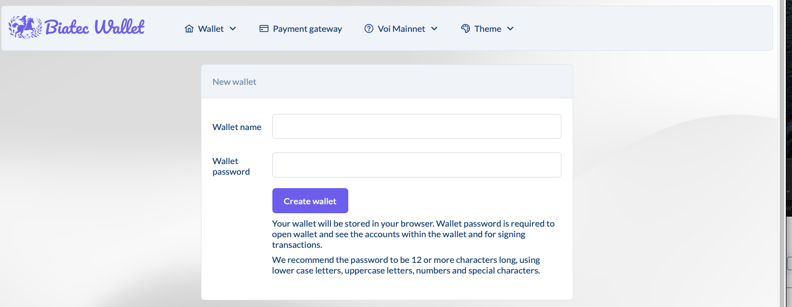
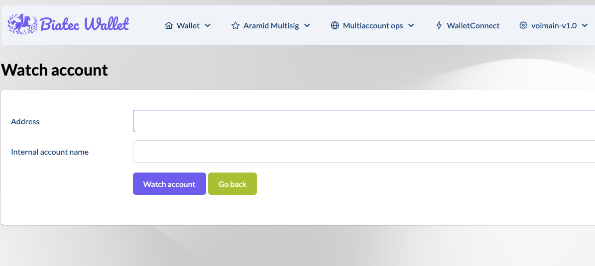
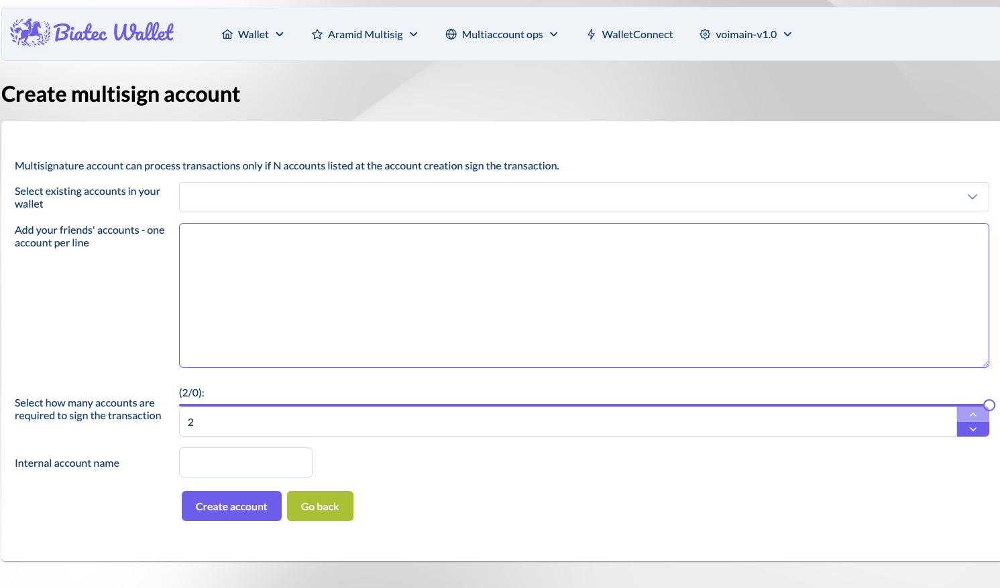
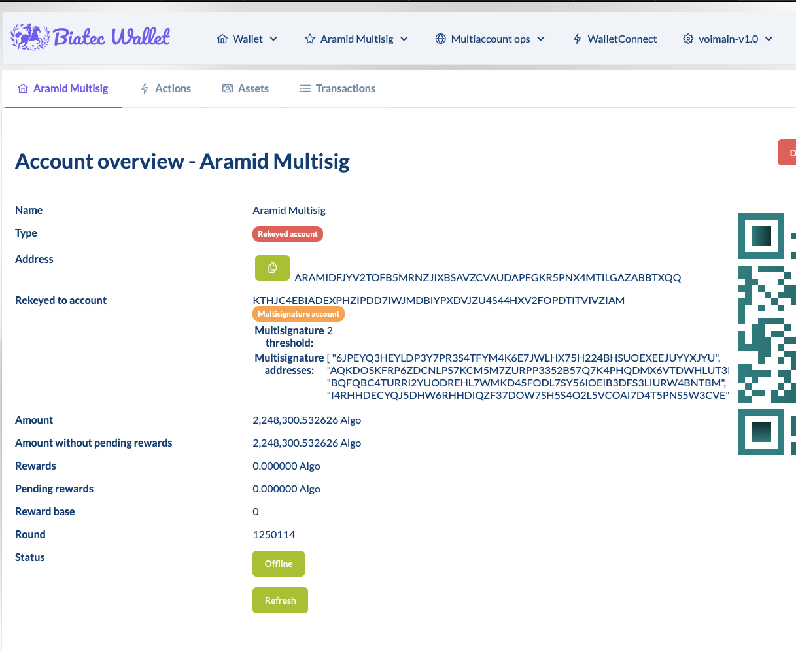
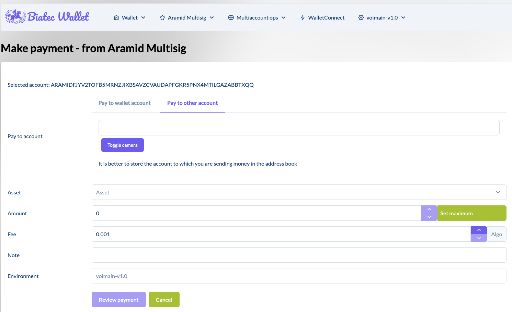
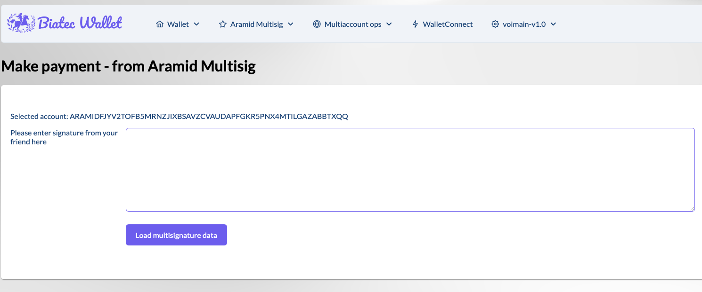

# How to Revert a Failed Transaction on the Aramid Bridge

A revert transaction is a way to correct a failed or problematic transaction by creating a new transaction that redistributes the assets to the correct account. This requires approval from multiple Soldier nodes via a multisig account.

This guide explains how to revert a failed transaction on the Aramid Bridge using a multisig account.

## What You Need

Before you begin, make sure you have the following:

- **Details of the failed transaction**: Source chain, sender account, asset, and amount involved.
- **Access to the [Biatec Wallet](https://wallet.biatec.io/)**.
- **The Soldier account** (which will be used for sending payment or co-signing).
- **The Aramid Bridge multisig account**.
- **The co-signer addresses** (Soldier nodes).
- **The multisig account for the transaction** (containing all Soldier nodes).

## Step-by-Step Guide

### Step 1: Sign in to Biatec Wallet

1. Go to the [Biatec Wallet](https://wallet.biatec.io/).
2. Log in using your credentials or create a new account.

### Step 2: Import Your Soldier Account

1. In the **Wallet** section, click **Import Account**.
2. Import your Soldier account using your mnemonic phrase.

### Step 3: Watch the Aramid Bridge Multisig Account

1. In the **Wallet** section, click on **Watch Account**.
2. Add the Aramid Bridge multisig account to your watch list by entering its address.

### Step 4: Create a New Multisig Account

If you don’t have a multisig account with the Soldier nodes set up yet, follow these steps:

1. In the **Wallet** section, click **Create Multisig Account**.
2. Add your Soldier account and the addresses of the Soldier nodes.
3. Define how many signatures are required for the transaction (e.g., 2 out of 3). The threshold should never be below 50%.
4. Click **Create Account**.

**Note:** After completing this, you will be able to see the threshold and addresses of the multisig account in the Aramid Account overview.

### Step 5: Initiate the Revert Transaction

1. From the Aramid Bridge multisig account, initiate a new transaction to revert the failed transaction.
2. Make sure to select the right network in settings. 
3. In the **Make New Payment** section, enter the following details:
   - **Pay to account**: The account intended to receive the reverted assets.
   - **Asset**: Select the asset that was involved in the failed transaction.
   - **Note**: Add a note such as `"REVERT [Transaction ID]"`.
4. Review all details carefully, and click **Send Payment**.

### Step 6: Share the Transaction Payload with Soldier Nodes

After creating and signing the revert transaction, copy the transaction payload by selecting **Toggle send to others form**.

Share the payload with the Soldier nodes (the co-signers of the multisig account).

### Step 7: Co-Signing the Revert Transaction (Soldier Account and Multisig Required)

Each Soldier node (co-signer) must:

1. Ensure their Soldier account is imported and present in the Biatec Wallet.
2. Go to the **Make New Payment** section within the wallet.
3. Select **Sign & Send Proposal**, then paste the payload.
4. Review the transaction details, sign it with the Soldier account, and submit.

Once the required signatures (as per the multisig threshold) have been collected, the transaction will automatically execute.

**Note:** Soldier nodes have 1000 rounds (approximately 2900 seconds or 48 minutes) to co-sign the revert transaction. If the required signatures are not collected within this time frame, the transaction will expire and will need to be recreated.
