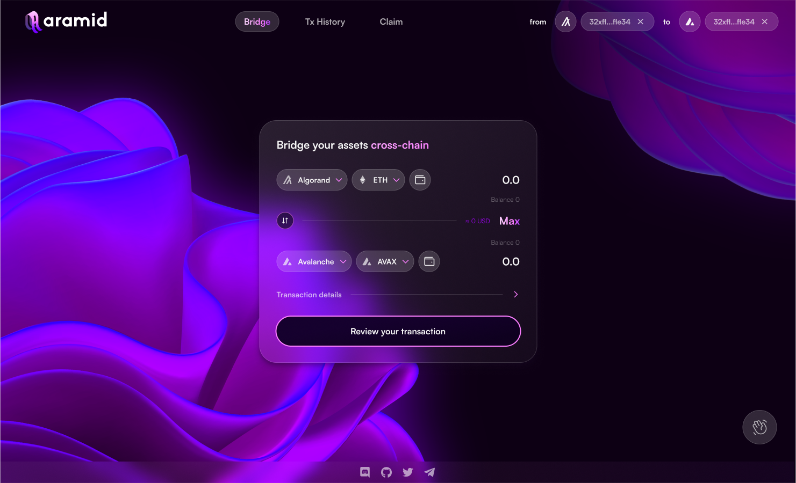
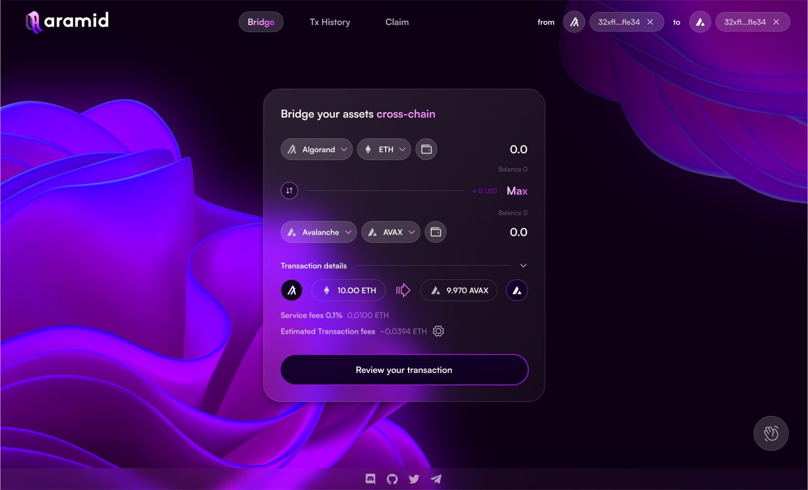
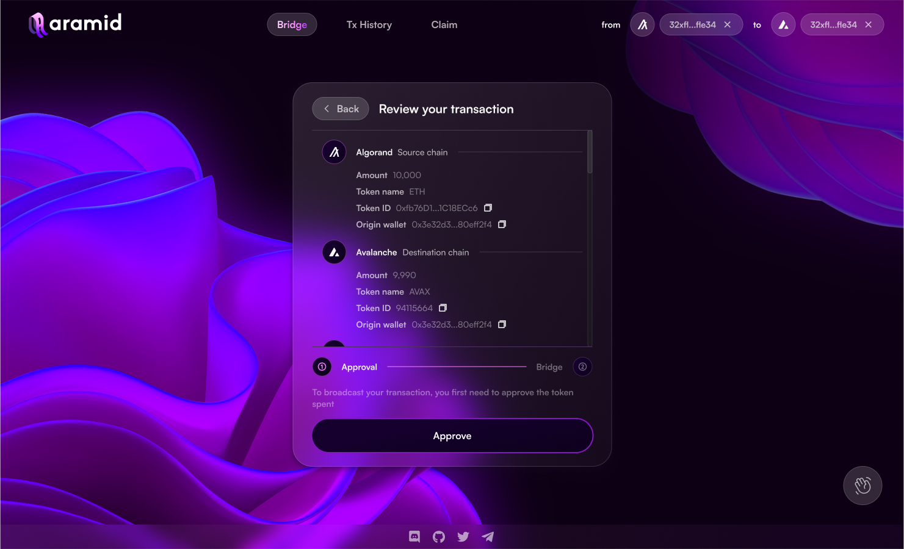
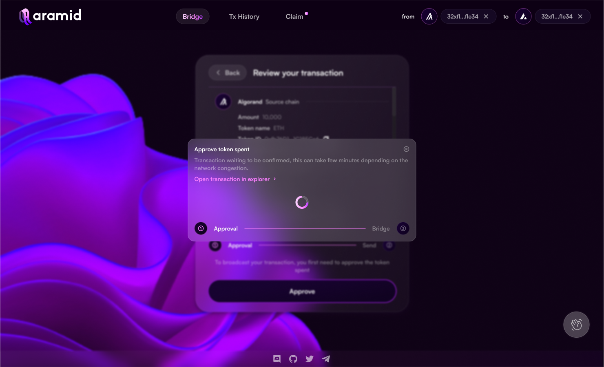
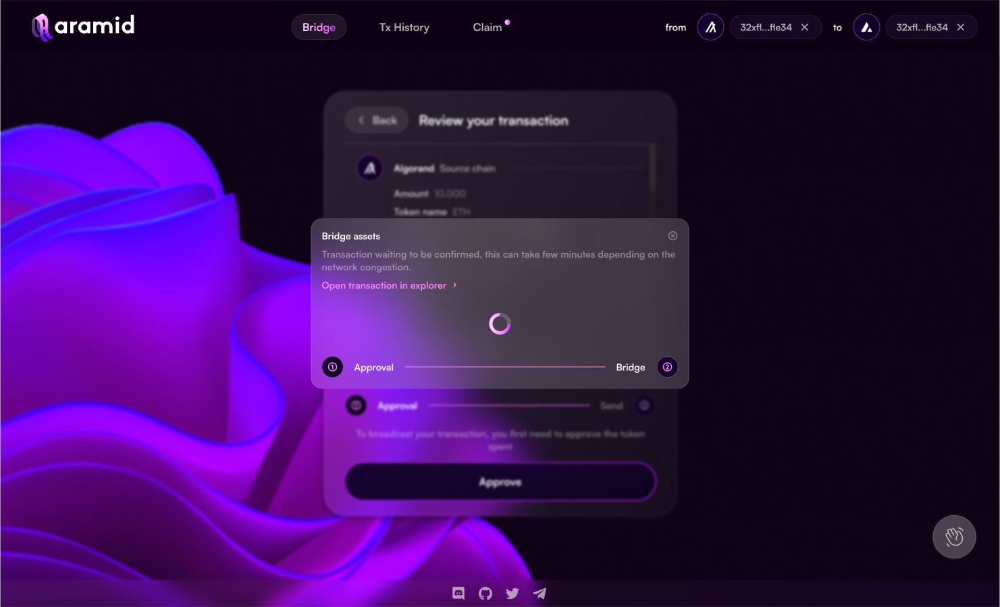
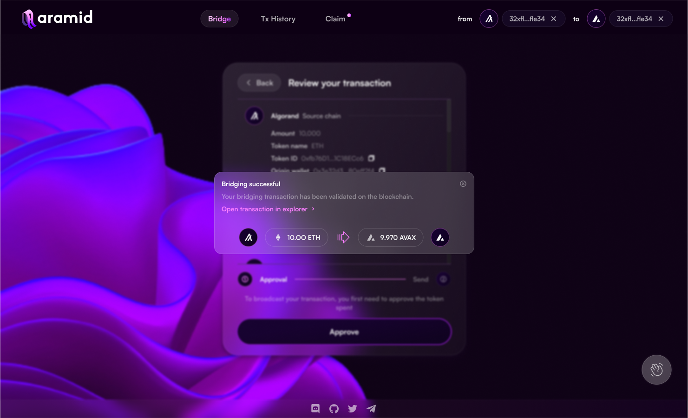

# Using Aramid Bridge

The Aramid Bridge enables users to transfer assets between supported networks with ease. Below is a step-by-step guide to help you bridge your assets securely.

## Step-by-Step Guide:

1. **Go to the Aramid Bridge Interface**
   Navigate to the [Aramid Bridge platform](https://app.aramid.finance).

2. **Connect Your Wallet**
   Click on the "Connect Wallet" button and select your preferred wallet (e.g., MetaMask, WalletConnect).

3. **Select Source and Destination Chains**
   Choose the blockchain you want to transfer from (source) and the blockchain you want to transfer to (destination).

   

4. **Select Asset and Enter Amount**
   Pick the asset you wish to transfer and enter the amount.

   

5. **Review and Confirm**
   Double-check all details, including fees, and confirm the transaction in your wallet.

   
   

6. **Wait for Confirmation**
   The bridge will process your transaction. This usually takes a few minutes, depending on network congestion.

   

7. **Receive Assets**
   Once the transaction is complete, you'll receive your assets on the destination chain.

   
   Remember to always ensure you have enough native tokens on both chains to cover gas fees.

## Important Considerations

- **Gas Fees**: Each transaction requires gas fees on both the source and destination chains.
- **Minimum Transfer Amounts**: There may be minimum transfer amounts to ensure the transaction value exceeds the gas costs.
- **Network Congestion**: During high traffic periods, transactions may take longer to process.
- **Asset Availability**: Not all assets are available on all chains. Check the supported assets list before initiating a transfer.

For any issues or questions, please refer to our [Support](/docs/support) page or join our Discord community for assistance.
